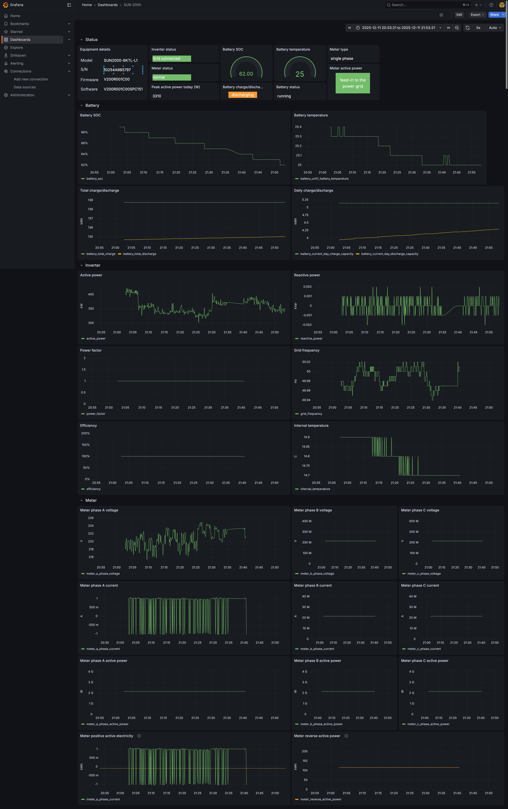

# sun2000_monitor

A Python project for monitoring and interacting with HuaweiSUN2000 inverter.

## Features

- Device monitoring
- Data collection with influxdb and grafana

## Requirements

- `Python 3.7+`
- `docker`, `docker-compose`
- `git`


## Installation

### Ensure connectivity to the inverter

SUN2000 manages its own WiFi network, named `SUN2000-<serial number>`, even though it's connected to your home WiFi.
This network runs on subnet `192.168.200.0/24`, the inverter is at `192.168.200.1`.
The inverter will accept register polling only from a single client from this subnet. If you plan to run `sun2000_monitor` from somewhere in your home network there are a number of approaches, eg:
- Raspberry Pi/other computer sitting between your home network and the SUN2000 WiFi, SNAT-ing packet to/from the inverter. Ethernet cable to the Pi, WiFi to the inverter. Run `sun2000_monitor` on another computer in your home network, point `SUN2000_INVERTER_HOST` to the ip/hostname of raspberry Pi.
- same as above, only run `sun2000_monitor` on the Pi itself.


### Clone the repository
```
git clone https://github.com/dibaciu/sun2000_monitor.git
cd sun2000_monitor
```

### Initial configuration

Run the following command to create the configuration files.
You will be prompted to enter the necessary configuration details. You can leave any value to the default; the only one that will need a custom value is `SUN2000_INVERTER_HOST`, which should be pointed at either the ip address of the inverter (`192.168.200.1`) or at the ip/hostname of the computer that is routing packets to the inverter, depending on the specific setup you have chosen.

```
python init.py
InfluxDB Host (default influx):
InfluxDB Port (default 8181):
InfluxDB Database Name (default sun2000_data):
InfluxDB Explorer Port (default 8888):
Grafana Admin User (default admin):
Grafana Port (default 3000):
Grafana Admin Password (default admin):
Sun2000 Inverter Host/IP: pi5.localdomain
Sun2000 Inverter Port (default 6607):
Polling Interval Seconds (default 5):
Generated environment files:
 - .env.test
 - .env.explorer.test
 - .env.grafana.test
 - .env.monitor.test
 - influxdb3.admin.token.test
 - influxdb3-explorer.config.test
 - docker-compose.yaml.test
```

### Start the services

## Build
`docker compose build`

## Start all services
`docker compose up -d`

### Accessing the services
- Grafana: `http://<your_host>:3000` (default user: `admin`, password: `admin`). If you set a custom password during init, find it in `.env.grafana` file.
- InfluxDB Explorer: `http://<your_host>:8888`

### Grafana dashboard
Import the dashboard from `SUN 2000.json` into your Grafana instance to visualize the data collected from the inverter.


### Notes

Plan was to run all this on a Raspberry Pi 5. I ran into issues getting InfluxDB 3 image running there (same issue as [here](https://github.com/influxdata/influxdb/issues/26066)).
As described there the fix was to build a custom InfluxDB 3 image for `linux/arm64` platform, with `jmealloc` settings adjusted for page size 16GB.

- forked the official InfluxDB 3 [repo](https://github.com/influxdata/influxdb).
- used branch 3.7 (latest as of June 2024).
- [modified](https://github.com/influxdata/influxdb/compare/3.7...dibaciu:influxdb:3.7?expand=1) `Dockerfile` to set `JEMALLOC_SYS_WITH_LG_PAGE=16`; other minor changes were needed to get the build working.
- cross compile for `linux/arm64` using `docker buildx` on a Mac M1 32 GB. I had to increase the builder instance memory to 28 GB to get the build to complete.

```azure
docker buildx build --platform linux/arm64 -t dibaciu/influxdb3:3.7
```

### Screenshot


